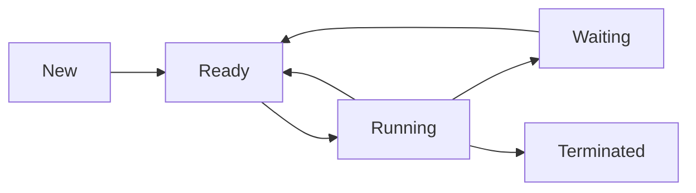

## **Unit 2: Process Management**  [LH-10Hrs]


### **2.1 Process Fundamentals**  

#### **1. Process vs Program**  
| **Program** | **Process** |  
|------------|------------|  
| Static executable file (e.g., `a.out`->executable file in linux) | Dynamic instance of a running program |  
| Stored on disk | Resides in RAM |  
| Passive entity | Active entity with state |  

**Example:**  
- **Program:** A Python script (`hello.py`) on disk.  
- **Process:** When executed (`python hello.py`), it becomes a process with a unique PID.  

**Note :**  
*"A program becomes a process when loaded into memory."*  

#### **2. Multiprogramming**  
**Definition:** Running multiple processes *concurrently* by switching the CPU between them.  

**Why Needed?**  
- Maximizes CPU utilization during I/O wait (e.g., while a process reads a file, another uses CPU).  

**Example:**  
- Browser (rendering page) + Text Editor (saving file) + Music Player running simultaneously.   

---

#### **3. Process Model**  
OS treats all processes as **independent sequential programs** with:  
- Own virtual CPU (illusion created via CPU scheduling).  
- Private address space (memory isolation).  

Processes interact via inter-process communication (IPC).
A process can create child processes, forming a process tree.

**Diagram:**  
```
Process 1 → [Code][Data][Stack][Heap]  
Process 2 → [Code][Data][Stack][Heap] 
```

---

#### **4. Process States**  
**5-State Model:**  
1. **New:** Process is being created.  
2. **Ready:** Waiting for CPU allocation.  
3. **Running:** Executing on CPU.  
4. **Waiting:** Blocked for I/O/event.  
5. **Terminated:** Finished execution.  

| **State**      | **Meaning**                                                | **Example**                                               |
| -------------- | ---------------------------------------------------------- | --------------------------------------------------------- |
| **New**        | Process is being created by the OS.                        | Browser is launched; OS begins setting up the process.    |
| **Ready**      | Process is in memory, waiting for CPU.                     | Browser is loaded in RAM, waiting in the scheduler queue. |
| **Running**    | Process is executing on the CPU.                           | Browser processes a webpage or runs a script.             |
| **Waiting**    | Process is waiting for I/O or an event to complete.        | Browser waits for network response after an HTTP request. |
| **Terminated** | Process has finished or was killed; OS reclaims resources. | Browser is closed; process is removed from process table. |


**State Transition Diagram:**  


**Question:**  
*"Why can’t a waiting process directly transition to running?"*  
**Answer:** It must first return to the ready queue first after I/O completion.  


#### **5. Process Control Block (PCB)**  
**Definition:** Kernel data structure storing process metadata.  

**PCB Contents(process metadata):**  
| **Field**       | **Purpose**                          |  
|-----------------|--------------------------------------|  
| Process ID (PID) | Unique identifier (e.g., `ps -ef`)   |  
| Program Counter | Next instruction address             |  
| CPU Registers   | Saved state during context switches  |  
| Memory Limits   | Address space boundaries             |  
| Open Files      | List of accessed files               |  


---

### **2.2 Threads**  

#### **1. Thread vs Process**  
| **Process** | **Thread** |  
|------------|-----------|  
| Heavyweight (isolated memory) | Lightweight (shared memory) |  
| Slower context switch | Faster context switch |  
| IPC via system calls | Communication via shared variables |  

**Analogy:**  
- **Process:** A factory with separate departments (isolated).  
- **Threads:** Workers in a department sharing resources (tools, space).  

**Example:**  
- **Chrome:** Each tab runs as a separate process (crash isolation).  
- **Word:** Spell-check runs in a thread (shares document memory).  


### **2. User vs Kernel Threads**  

#### **User-Level Threads (ULT)**  
- Managed by user-space libraries (e.g., Python `threading`).  
- **Pros:**  
  - No kernel mode switching (faster).  
  - Portable (OS-agnostic).  
- **Cons:**  
  - Blocking one thread blocks all (no true parallelism).  

#### **Kernel-Level Threads (KLT)**  
- Managed directly by the OS (e.g., Linux `pthreads`).  
- **Pros:**  
  - True parallelism (multicore support).  
  - Kernel handles blocking I/O.  
- **Cons:**  
  - Slower creation/context switch.  

**Hybrid Approach (Linux):**  
- Uses `1:1` model (each user thread maps to kernel thread).  

**Memory Aid:**  
- Process = Company, Threads = Employees.  
- ULT = Interns (cheap but limited), KLT = Full-timers (powerful but costly).

---

### **2.3 Inter Process Communication (IPC), Race Condition, Critical Section**  

#### **1. Inter Process Communication (IPC)**  
 
IPC is a mechanism that allows processes to communicate and synchronize their actions. Processes may run on the same system or different systems connected via a network.  

**Why IPC?**  
- Processes often need to share data (e.g., producer-consumer problem).  
- Some tasks require coordination (e.g., avoiding simultaneous file access).  

**Methods of IPC:**  
#### **(A) Shared Memory**  
- Processes share a common memory region.  
- Faster than message passing (no kernel intervention).  
- **Example:** A shared buffer between a producer and consumer process.  

#### **(B) Message Passing**  
- Processes communicate via system calls (`send()` and `receive()`).  
- Works for both same-machine and distributed systems.  
- **Example:** Pipes in Unix (`|` operator in shell commands).  

#### **Diagram: IPC Methods**  
```
+-------------------+       +-------------------+
| Process A         |       | Process B         |
| (Shared Memory)   |<----->| (Shared Memory)   |
+-------------------+       +-------------------+
          ^                         ^
          | Kernel Mediation         |
          v                         v
+-------------------+       +-------------------+
| Process X         |       | Process Y         |
| (Message Passing) |<----->| (Message Passing) |
+-------------------+       +-------------------+
```


#### **2. Race Condition**  
 
A race condition occurs when multiple processes access shared data concurrently, and the final outcome depends on the order of execution.  

**Why is it a Problem?**  
- Leads to inconsistent data.  
- Hard to reproduce and debug.

**Example:**  
Two processes (P1 and P2) increment a shared variable `count = 5`:  
1. P1 reads `count = 5`.  
2. P2 reads `count = 5`.  
3. P1 increments to `6` and writes back.  
4. P2 increments to `6` and writes back.  
- **Expected:** `count = 7` (if sequential).  
- **Actual:** `count = 6` (due to race).  

### **Diagram: Race Condition**  
```
P1: Read (5) → Increment (6) → Write (6)  
P2: Read (5) → Increment (6) → Write (6)  
Final value: 6 (instead of 7)  
```


#### **3. Critical Section**  

A segment of code where shared resources (variables, files, etc.) are accessed.  

**Requirements for Critical Section Problem:**  
1. **Mutual Exclusion:** Only one process can execute in the critical section at a time.  
2. **Progress:** If no process is in the critical section, another process must be allowed to enter.  
3. **Bounded Waiting:** No process should wait indefinitely.  


**Solutions to Critical Section Problem:**  
1. **Peterson’s Algorithm** (Software-based, for 2 processes).  
2. **Mutex Locks** (Hardware-based, `acquire()` and `release()`).  
3. **Semaphores** (Generalized mutex, `wait()` and `signal()`).  

**Diagram: Critical Section Handling**  
```
+---------------------+
| Entry Section       | ← Ensures mutual exclusion
+---------------------+
| Critical Section    | ← Shared resource access
+---------------------+
| Exit Section        | ← Releases lock
+---------------------+
```

---

### **2.4 Implementing Mutual Exclusion**  
Mutual Exclusion ensures that only one process/thread accesses the critical section (shared resources) at a time, preventing race conditions.

#### **1. Mutual Exclusion with Busy Waiting**  

Busy waiting (or spinlock) means a process continuously checks for a condition (e.g., a lock) in a loop while waiting to enter the critical section.  

**Methods:**  
**(A) Disabling Interrupts**  
- **How?** Disable interrupts before entering the critical section.  
- **Pros:** Simple (works for single-core systems).  
- **Cons:**  
  - Dangerous in user mode (only kernel should disable interrupts).  
  - Doesn’t work for multi-core systems.  
- **Example:**  
  ```asm
  CLI ; Disable interrupts (x86 instruction)  
  ; Critical Section  
  STI ; Enable interrupts  
  ```

**(B) Lock Variables**  
- **How?** A shared `lock` variable (`0` = free, `1` = busy).  
- **Problem:** Race condition in checking and setting the lock.  
- **Example:**  
  ```c
  while (lock == 1);  // Busy wait  
  lock = 1;           // Race condition here!  
  // Critical Section  
  lock = 0;  
  ```

**(C) Strict Alternation (Turn Variable)**  
- **How?** Processes take turns using a `turn` variable.  
- **Problem:** Violates *Progress* (a process must wait even if the other is idle).  
- **Example:**  
  ```c
  // Process 0  
  while (turn != 0); // Wait  
  // Critical Section  
  turn = 1;  

  // Process 1  
  while (turn != 1); // Wait  
  // Critical Section  
  turn = 0;  
  ```

**(D) Peterson’s Solution**  
- **How?** Uses `turn` and `flag[2]` (for 2 processes).  
- **Satisfies:** Mutual Exclusion, Progress, Bounded Waiting.  
- **Example:**  
  ```c
  int flag[2] = {0, 0}, turn = 0;  

  // Process i  
  flag[i] = 1;          // I’m ready  
  turn = 1 - i;          // Let the other go first  
  while (flag[1-i] && turn == 1-i);  
  // Critical Section  
  flag[i] = 0;          // I’m done  
  ```

**(E) Test and Set Lock (TSL)**  
- **How?** Hardware instruction (`TSL RX, LOCK`) sets lock and returns old value atomically.  
- **Example:**  
  ```asm
  TSL R0, LOCK   ; Copy LOCK to R0 and set LOCK=1  
  CMP R0, #0     ; Was LOCK 0?  
  JNE WAIT       ; If not, wait  
  ; Critical Section  
  MOV LOCK, #0   ; Release lock  
  ```


#### **2. Sleep and Wakeup**  
 
Instead of busy waiting, the OS puts the process to sleep and wakes it when the lock is free.  

### **Example (Producer-Consumer Problem):**  
```c
// Producer  
while (count == BUFFER_SIZE) sleep();  
// Produce item  
wakeup(Consumer);  

// Consumer  
while (count == 0) sleep();  
// Consume item  
wakeup(Producer);  
```

**Problem: Lost Wakeup**  
- If `wakeup` is called before `sleep`, the signal is lost.  
- **Solution:** Use **semaphores**.  

---

### **3. Semaphores**  
 
An integer variable (`S`) accessed only via atomic operations:  
- `wait(S)` (or `P`): Decrements `S`; if `S < 0`, the process sleeps.  
- `signal(S)` (or `V`): Increments `S`; wakes up a waiting process.  

**Types:**  
1. **Binary Semaphore (`S = 0 or 1`)** → Acts like a mutex lock.  
2. **Counting Semaphore (`S = N`)** → Allows `N` processes in critical section.  

**Example (Mutex with Semaphore):**  
```c
semaphore S = 1;  

// Process P1  
wait(S);  
// Critical Section  
signal(S);  
```

### **Problem: Deadlocks**  
- If two processes wait for each other’s resources.  

---

#### **4. Monitors**  
 
A high-level synchronization construct where shared data and procedures are grouped together.  

**Features:**  
- Only one process can execute a monitor procedure at a time.  
- Uses **condition variables** (`wait()`, `signal()`).  

### **Example (Bounded Buffer Monitor):**  
```java
monitor BoundedBuffer {  
  int buffer[N];  
  condition full, empty;  

  void produce(item) {  
    if (buffer.isFull()) empty.wait();  
    buffer.add(item);  
    full.signal();  
  }  

  void consume() {  
    if (buffer.isEmpty()) full.wait();  
    item = buffer.remove();  
    empty.signal();  
  }  
}  
```

---

#### **5. Message Passing**  
  
Processes communicate via messages (`send()` and `receive()`).  

**Types:**  
1. **Blocking (Synchronous):**  
   - `send()` blocks until the message is received.  
   - `receive()` blocks until a message arrives.  
2. **Non-Blocking (Asynchronous):**  
   - `send()` returns immediately.  
   - `receive()` checks for a message (may return empty).  

**Example (Client-Server):**  
```c
// Server  
while (1) {  
  receive(REQUEST, &client);  
  // Process request  
  send(REPLY, client);  
}  

// Client  
send(REQUEST, server);  
receive(REPLY, &response);  
```

---

# **Process Scheduling: Detailed Notes**  

## **2.6 Process Scheduling**  
Process scheduling is the mechanism used by the OS to select which process runs next on the CPU. The **scheduler** is responsible for allocating CPU time efficiently based on scheduling algorithms.  

### **Key Terms:**  
1. **Process Scheduling** – The act of selecting a process from the ready queue to execute on the CPU.  
2. **Scheduler** – The OS component that decides the order of process execution.  
3. **Ready Queue** – A queue of processes in main memory that are ready to execute.  
4. **Preemptive Scheduling** – A process can be interrupted and moved back to the ready queue before completion.  
5. **Non-Preemptive Scheduling** – A process runs until it completes or voluntarily yields the CPU.  
6. **Turnaround Time** – Total time taken from process submission to completion.  
7. **Waiting Time** – Total time a process spends waiting in the ready queue.  
8. **Response Time** – Time taken from submission until the first response (for interactive systems).  
9. **Throughput** – Number of processes completed per unit time.  
10. **CPU Utilization** – Percentage of time the CPU is busy (not idle).  

---

## **Goals of Process Scheduling**  
1. **Fairness** – All processes should get a fair share of CPU time.  
2. **Efficiency** – Maximize CPU utilization and throughput.  
3. **Minimize Response Time** – Important for interactive systems.  
4. **Minimize Turnaround Time** – Important for batch systems.  
5. **Avoid Starvation** – No process should wait indefinitely.  

---

# **Process Scheduling Numericals (Scenarios 1 & 2)**  

- **Scenario 1:** All processes arrive at the same time (Arrival Time = 0).  
- **Scenario 2:** Processes arrive at different times (Variable Arrival Time).  


## **1. First-Come First-Served (FCFS) Scheduling**  
### **Scenario 1: Same Arrival Time**  
| Process | Arrival Time (AT) | Burst Time (BT) |
|---------|-------------------|-----------------|
| P1      | 0                 | 6               |
| P2      | 0                 | 3               |
| P3      | 0                 | 8               |

**Gantt Chart:**  
`P1 (0–6) → P2 (6–9) → P3 (9–17)`  

**Calculations:**  
- **Turnaround Time (TAT) = Completion Time (CT) - AT**  
  - P1: 6 - 0 = 6  
  - P2: 9 - 0 = 9  
  - P3: 17 - 0 = 17  
- **Waiting Time (WT) = TAT - BT**  
  - P1: 6 - 6 = 0  
  - P2: 9 - 3 = 6  
  - P3: 17 - 8 = 9  
- **Average WT = (0 + 6 + 9)/3 = 5**  

---

### **Scenario 2: Different Arrival Times**  
| Process | AT | BT |
|---------|----|----|
| P1      | 0  | 6  |
| P2      | 2  | 3  |
| P3      | 4  | 8  |

**Gantt Chart:**  
`P1 (0–6) → P2 (6–9) → P3 (9–17)`  

**Calculations:**  
- **TAT = CT - AT**  
  - P1: 6 - 0 = 6  
  - P2: 9 - 2 = 7  
  - P3: 17 - 4 = 13  
- **WT = TAT - BT**  
  - P1: 6 - 6 = 0  
  - P2: 7 - 3 = 4  
  - P3: 13 - 8 = 5  
- **Average WT = (0 + 4 + 5)/3 = 3**  

---

## **2. Shortest Job First (SJF) Scheduling**  
### **Scenario 1: Same Arrival Time**  
| Process | AT | BT |
|---------|----|----|
| P1      | 0  | 6  |
| P2      | 0  | 3  |
| P3      | 0  | 8  |

**Gantt Chart:**  
`P2 (0–3) → P1 (3–9) → P3 (9–17)`  

**Calculations:**  
- **TAT = CT - AT**  
  - P2: 3 - 0 = 3  
  - P1: 9 - 0 = 9  
  - P3: 17 - 0 = 17  
- **WT = TAT - BT**  
  - P2: 3 - 3 = 0  
  - P1: 9 - 6 = 3  
  - P3: 17 - 8 = 9  
- **Average WT = (0 + 3 + 9)/3 = 4**  

---

### **Scenario 2: Different Arrival Times**  
| Process | AT | BT |
|---------|----|----|
| P1      | 0  | 6  |
| P2      | 2  | 3  |
| P3      | 4  | 8  |

**Gantt Chart:**  
`P1 (0–2) → P2 (2–5) → P1 (5–8) → P3 (8–16)`  

**Calculations:**  
- **TAT = CT - AT**  
  - P1: 8 - 0 = 8  
  - P2: 5 - 2 = 3  
  - P3: 16 - 4 = 12  
- **WT = TAT - BT**  
  - P1: 8 - 6 = 2  
  - P2: 3 - 3 = 0  
  - P3: 12 - 8 = 4  
- **Average WT = (2 + 0 + 4)/3 = 2**  

---

## **3. Shortest Remaining Time Next (SRTN) Scheduling**  
### **Scenario 1: Same Arrival Time (Same as SJF)**  
| Process | AT | BT |
|---------|----|----|
| P1      | 0  | 6  |
| P2      | 0  | 3  |
| P3      | 0  | 8  |

**Gantt Chart:**  
`P2 (0–3) → P1 (3–9) → P3 (9–17)`  

**Calculations:**  
- Same as SJF (since no new arrivals).  

---

### **Scenario 2: Different Arrival Times**  
| Process | AT | BT |
|---------|----|----|
| P1      | 0  | 6  |
| P2      | 2  | 3  |
| P3      | 4  | 8  |

**Gantt Chart:**  
`P1 (0–2) → P2 (2–5) → P1 (5–8) → P3 (8–16)`  

**Calculations:**  
- **TAT = CT - AT**  
  - P1: 8 - 0 = 8  
  - P2: 5 - 2 = 3  
  - P3: 16 - 4 = 12  
- **WT = TAT - BT**  
  - P1: 8 - 6 = 2  
  - P2: 3 - 3 = 0  
  - P3: 12 - 8 = 4  
- **Average WT = (2 + 0 + 4)/3 = 2**  

---

## **4. Round-Robin (RR) Scheduling**  
### **Scenario 1: Same Arrival Time (Time Quantum = 2)**  
| Process | AT | BT |
|---------|----|----|
| P1      | 0  | 6  |
| P2      | 0  | 3  |
| P3      | 0  | 8  |

**Gantt Chart:**  
`P1 (0–2) → P2 (2–4) → P3 (4–6) → P1 (6–8) → P2 (8–9) → P3 (9–11) → P1 (11–13) → P3 (13–15) → P3 (15–17)`  

**Calculations:**  
- **TAT = CT - AT**  
  - P1: 13 - 0 = 13  
  - P2: 9 - 0 = 9  
  - P3: 17 - 0 = 17  
- **WT = TAT - BT**  
  - P1: 13 - 6 = 7  
  - P2: 9 - 3 = 6  
  - P3: 17 - 8 = 9  
- **Average WT = (7 + 6 + 9)/3 ≈ 7.33**  

---

### **Scenario 2: Different Arrival Times (Time Quantum = 2)**  
| Process | AT | BT |
|---------|----|----|
| P1      | 0  | 6  |
| P2      | 2  | 3  |
| P3      | 4  | 8  |

**Gantt Chart:**  
`P1 (0–2) → P2 (2–4) → P1 (4–6) → P3 (6–8) → P2 (8–9) → P1 (9–11) → P3 (11–13) → P1 (13–15) → P3 (15–17)`  

**Calculations:**  
- **TAT = CT - AT**  
  - P1: 15 - 0 = 15  
  - P2: 9 - 2 = 7  
  - P3: 17 - 4 = 13  
- **WT = TAT - BT**  
  - P1: 15 - 6 = 9  
  - P2: 7 - 3 = 4  
  - P3: 13 - 8 = 5  
- **Average WT = (9 + 4 + 5)/3 = 6**  

---

## **5. Priority Scheduling**  
### **Scenario 1: Same Arrival Time (Lower Number = Higher Priority)**  
| Process | AT | BT | Priority |
|---------|----|----|----------|
| P1      | 0  | 6  | 3        |
| P2      | 0  | 3  | 1        |
| P3      | 0  | 8  | 2        |

**Gantt Chart:**  
`P2 (0–3) → P3 (3–11) → P1 (11–17)`  

**Calculations:**  
- **TAT = CT - AT**  
  - P2: 3 - 0 = 3  
  - P3: 11 - 0 = 11  
  - P1: 17 - 0 = 17  
- **WT = TAT - BT**  
  - P2: 3 - 3 = 0  
  - P3: 11 - 8 = 3  
  - P1: 17 - 6 = 11  
- **Average WT = (0 + 3 + 11)/3 ≈ 4.67**  

---

### **Scenario 2: Different Arrival Times (Preemptive Priority)**  
| Process | AT | BT | Priority |
|---------|----|----|----------|
| P1      | 0  | 6  | 3        |
| P2      | 2  | 3  | 1        |
| P3      | 4  | 8  | 2        |

**Gantt Chart:**  
`P1 (0–2) → P2 (2–5) → P3 (5–13) → P1 (13–17)`  

**Calculations:**  
- **TAT = CT - AT**  
  - P1: 17 - 0 = 17  
  - P2: 5 - 2 = 3  
  - P3: 13 - 4 = 9  
- **WT = TAT - BT**  
  - P1: 17 - 6 = 11  
  - P2: 3 - 3 = 0  
  - P3: 9 - 8 = 1  
- **Average WT = (11 + 0 + 1)/3 = 4**  

---

## **Summary of Results**  
| Algorithm | Scenario | Avg. Waiting Time |
|-----------|----------|-------------------|
| FCFS      | Same AT  | 5                 |
| FCFS      | Diff AT  | 3                 |
| SJF       | Same AT  | 4                 |
| SJF       | Diff AT  | 2                 |
| SRTN      | Diff AT  | 2                 |
| RR (q=2)  | Same AT  | 7.33              |
| RR (q=2)  | Diff AT  | 6                 |
| Priority  | Same AT  | 4.67              |
| Priority  | Diff AT  | 4                 |

### **Key Observations:**  
1. **FCFS** performs poorly with long processes at the front.  
2. **SJF/SRTN** gives the **lowest waiting time** but requires burst time knowledge.  
3. **RR** balances fairness and response time but has higher waiting time.  
4. **Priority Scheduling** can lead to starvation (fixed via aging).  


