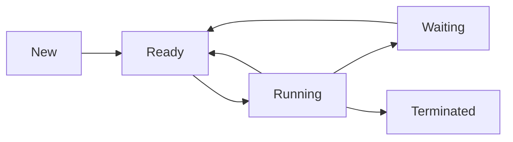

## **Unit 2: Process Management**  [LH-10Hrs]


### **2.1 Process Fundamentals**  

#### **1. Process vs Program**  
| **Program** | **Process** |  
|------------|------------|  
| Static executable file (e.g., `a.out`->executable file in linux) | Dynamic instance of a running program |  
| Stored on disk | Resides in RAM |  
| Passive entity | Active entity with state |  

**Example:**  
- **Program:** A Python script (`hello.py`) on disk.  
- **Process:** When executed (`python hello.py`), it becomes a process with a unique PID.  

**Note :**  
*"A program becomes a process when loaded into memory."*  

#### **2. Multiprogramming**  
**Definition:** Running multiple processes *concurrently* by switching the CPU between them.  

**Why Needed?**  
- Maximizes CPU utilization during I/O wait (e.g., while a process reads a file, another uses CPU).  

**Example:**  
- Browser (rendering page) + Text Editor (saving file) + Music Player running simultaneously.   

---

#### **3. Process Model**  
OS treats all processes as **independent sequential programs** with:  
- Own virtual CPU (illusion created via CPU scheduling).  
- Private address space (memory isolation).  

- Processes interact via inter-process communication (IPC).
- A process can create child processes, forming a process tree.

**Diagram:**  
```
Process 1 → [Code][Data][Stack][Heap]  
Process 2 → [Code][Data][Stack][Heap] 
```

---

#### **4. Process States**  
**5-State Model:**  
1. **New:** Process is being created.  
2. **Ready:** Waiting for CPU allocation.  
3. **Running:** Executing on CPU.  
4. **Waiting:** Blocked for I/O/event.  
5. **Terminated:** Finished execution.  

| **State**      | **Meaning**                                                | **Example**                                               |
| -------------- | ---------------------------------------------------------- | --------------------------------------------------------- |
| **New**        | Process is being created by the OS.                        | Browser is launched; OS begins setting up the process.    |
| **Ready**      | Process is in memory, waiting for CPU.                     | Browser is loaded in RAM, waiting in the scheduler queue. |
| **Running**    | Process is executing on the CPU.                           | Browser processes a webpage or runs a script.             |
| **Waiting**    | Process is waiting for I/O or an event to complete.        | Browser waits for network response after an HTTP request. |
| **Terminated** | Process has finished or was killed; OS reclaims resources. | Browser is closed; process is removed from process table. |


**State Transition Diagram:**  


**Question:**  
*"Why can’t a waiting process directly transition to running?"*  
**Answer:** It must first return to the ready queue first after I/O completion.  


#### **5. Process Control Block (PCB)**  
**Definition:** Kernel data structure storing process metadata.  

**PCB Contents(process metadata):**  
| **Field**       | **Purpose**                          |  
|-----------------|--------------------------------------|  
| Process ID (PID) | Unique identifier (e.g., `ps -ef`)   |  
| Program Counter | Next instruction address             |  
| CPU Registers   | Saved state during context switches  |  
| Memory Limits   | Address space boundaries             |  
| Open Files      | List of accessed files               |  


---

### **2.2 Threads**  

#### **1. Thread vs Process**  
| **Process** | **Thread** |  
|------------|-----------|  
| Heavyweight (isolated memory) | Lightweight (shared memory) |  
| Slower context switch | Faster context switch |  
| IPC via system calls | Communication via shared variables |  

**Analogy:**  
- **Process:** A factory with separate departments (isolated).  
- **Threads:** Workers in a department sharing resources (tools, space).  

**Example:**  
- **Chrome:** Each tab runs as a separate process (crash isolation).  
- **Word:** Spell-check runs in a thread (shares document memory).  


### **2. User vs Kernel Threads**  

#### **User-Level Threads (ULT)**  
- Managed by user-space libraries (e.g., Python `threading`).  
- **Pros:**  
  - No kernel mode switching (faster).  
  - Portable (OS-agnostic).  
- **Cons:**  
  - Blocking one thread blocks all (no true parallelism).  

#### **Kernel-Level Threads (KLT)**  
- Managed directly by the OS (e.g., Linux `pthreads`).  
- **Pros:**  
  - True parallelism (multicore support).  
  - Kernel handles blocking I/O.  
- **Cons:**  
  - Slower creation/context switch.  

**Hybrid Approach (Linux):**  
- Uses `1:1` model (each user thread maps to kernel thread).  

**Memory Aid:**  
- Process = Company, Threads = Employees.  
- ULT = Interns (cheap but limited), KLT = Full-timers (powerful but costly).  
