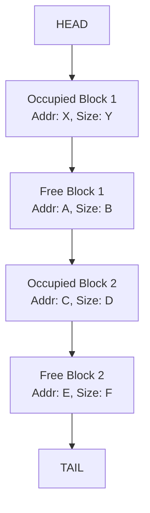

# Unit 4: Memory Management (8 Hrs.)

<br><br>

## **4.1.1. Introduction to Memory Management**

Memory management is the process of coordinating and controlling the use of a computer's primary memory (RAM). Its goals include:
* **Efficiency:** Maximizing CPU utilization by keeping multiple processes in memory.
* **Protection:** Ensuring that processes do not interfere with each other's memory spaces or the operating system's memory.
* **Relocation:** Allowing programs to be loaded into any available memory location.
* **Sharing:** Enabling multiple processes to share common code or data.
* **Logical Organization:** Providing a logical view of memory that is independent of physical memory.

## **4.1.2. Monoprogramming vs. Multiprogramming**

**Monoprogramming:**
* **Explanation:** In a monoprogramming system, only one program resides in main memory at a time and has exclusive control over the CPU and memory. Once that program starts, it runs to completion before another program can be loaded.
* **Advantages:**
    * Simple memory management.
    * No need for complex protection mechanisms between user programs.
* **Disadvantages:**
    * Extremely low CPU utilization, especially when the single program performs I/O operations (the CPU remains idle).
    * No concurrency; inefficient use of computing resources.
* **Example:** Early MS-DOS systems before multitasking features were widely adopted.

**Multiprogramming:**
* **Explanation:** Multiprogramming is a technique where the operating system keeps multiple user programs in main memory simultaneously. When one program is performing a slow operation (like I/O), the CPU switches to another program that is ready to execute. This significantly increases CPU utilization and overall system throughput.
* **Advantages:**
    * Higher CPU utilization.
    * Increased system throughput (more jobs completed per unit time).
    * Better interactive response time for multiple users (in time-sharing systems).
* **Disadvantages:**
    * Requires more complex memory management to allocate and protect memory for multiple programs.
    * Requires CPU scheduling to manage context switching between programs.
    * Increased overhead for the OS.
* **Example:** Modern operating systems like Linux, Windows, macOS, which allow users to run multiple applications concurrently (e.g., web browser, word processor, music player all open at once).

## **4.1.3. Modelling Multiprogramming**

Multiprogramming efficiency can be modeled to understand its benefits. A simple probabilistic model can be used to estimate CPU utilization.
* **Assumptions:** A system with $N$ processes in memory, and each process spends a fraction $p$ of its time waiting for I/O.
* **CPU Utilization Formula:** The probability that all $N$ processes are waiting for I/O is $p^N$. Therefore, the CPU utilization is $1 - p^N$.
* **Practical Example:** If a process spends 80% ($p=0.8$) of its time on I/O, then:
    * With monoprogramming ($N=1$): CPU utilization = $1 - 0.8^1 = 0.2$ (20%).
    * With 4 processes ($N=4$): CPU utilization = $1 - 0.8^4 = 1 - 0.4096 = 0.5904$ (approx. 59%).
    * This model demonstrates how CPU utilization significantly increases with a higher degree of multiprogramming, especially when processes are I/O-bound.

## **4.1.4. Multiprogramming with Fixed and Variable Partitions**

These are early memory management techniques for multiprogramming:

**Fixed Partitions (Static Partitioning):**
* **Explanation:** Main memory is divided into a fixed number of partitions at system startup. Each partition has a predefined size. A program can be loaded into any partition that is large enough to hold it.
* **Types:**
    * **Equal-sized partitions:** All partitions have the same size.
    * **Unequal-sized partitions:** Partitions have different sizes to accommodate programs of various memory requirements.
* **Advantages:**
    * Simple to implement.
    * Relatively low overhead.
* **Disadvantages:**
    * **Internal Fragmentation:** If a program is loaded into a partition larger than its actual size, the unused space within that partition is wasted.
    * **Limited Degree of Multiprogramming:** The number of active programs is limited by the number of fixed partitions.
    * **Fixed Partition Size:** Cannot load a program larger than the largest partition.
* **Example:** A 1MB memory divided into four 256KB partitions. If a 100KB program loads into a 256KB partition, 156KB is wasted (internal fragmentation).

**Diagram: Fixed Partitions**
*(Mention to insert a diagram here showing main memory divided into several distinct, fixed-size blocks, with some blocks containing processes and some showing internal fragmentation, and some being empty.)*
```mermaid
graph TD
    M[Main Memory]
    M --> P1[Partition 1 (1MB)]
    M --> P2[Partition 2 (0.5MB)]
    M --> P3[Partition 3 (0.5MB)]
    M --> P4[Partition 4 (2MB)]

    P1 -- Contains --> A[Process A (0.8MB)]
    P1 -- Wasted --> W1[0.2MB Wasted (Internal Fragmentation)]
    P2 -- Contains --> B[Process B (0.4MB)]
    P2 -- Wasted --> W2[0.1MB Wasted]
    P3 -- Contains --> Empty[Empty]
    P4 -- Contains --> C[Process C (1.5MB)]
    P4 -- Wasted --> W3[0.5MB Wasted]
```
*Figure: Fixed Partitions with Internal Fragmentation*

**Variable Partitions (Dynamic Partitioning):**
* **Explanation:** Memory is not partitioned beforehand. When a program needs to be loaded, the OS allocates a contiguous block of memory exactly equal to the program's size. When a program terminates, its memory is returned to a pool of free memory, potentially creating small, non-contiguous free blocks (holes).
* **Advantages:**
    * **No Internal Fragmentation:** Memory is allocated exactly to the program's needs.
    * More efficient use of memory compared to fixed partitions.
    * Degree of multiprogramming is limited only by total memory, not number of fixed partitions.
* **Disadvantages:**
    * **External Fragmentation:** As processes are loaded and unloaded, memory becomes fragmented into many small, non-contiguous free blocks. These small holes might collectively be large enough to satisfy a new request, but no single hole is large enough. This makes it difficult to allocate larger programs.
    * More complex to implement.
    * Requires **compaction** to alleviate external fragmentation, which is a costly operation that moves all processes to one end of memory to consolidate free space.
* **Example:** A 5MB memory. Process A (2MB) loads. Process B (1MB) loads. Process A terminates, leaving a 2MB hole. Process C (3MB) wants to load, but the 2MB hole is too small. Even though 4MB total free space (2MB + 1MB after B) might exist, it's fragmented.

**Diagram: Variable Partitions and External Fragmentation**
*(Mention to insert a diagram here showing main memory with processes loaded into variable-sized blocks, and multiple small, non-contiguous "holes" of free space.)*
```mermaid
graph TD
    M[Main Memory]
    M_Start[0] --> A[Process A (2MB)]
    A --> H1[Hole 1 (1MB)]
    H1 --> B[Process B (1.5MB)]
    B --> H2[Hole 2 (0.5MB)]
    H2 --> C[Process C (1MB)]
    C --> H3[Hole 3 (1.5MB)]
    H3 --> M_End[End of Memory]
```
*Figure: Variable Partitions with External Fragmentation*

**Comparison Table: Fixed vs. Variable Partitions**

| Feature                   | Fixed Partitions                     | Variable Partitions                    |
| :------------------------ | :----------------------------------- | :------------------------------------- |
| Memory Allocation         | Pre-divided, static size             | Dynamic, exact size of process         |
| Internal Fragmentation    | Yes, significant           | No                           |
| External Fragmentation    | No (or minimal)                      | Yes, significant             |
| Degree of Multiprogramming| Limited by number of partitions      | Limited by total memory size           |
| Complexity                | Simple                               | More complex                           |
| Compaction Required       | No                                   | Yes, to reduce external fragmentation |

## **4.1.5. Relocation and Protection**

**Relocation:**
* **Explanation:** Relocation refers to the ability to load a process into any available contiguous block of physical memory, rather than requiring it to load at a fixed, predefined address. This is crucial for multiprogramming, as memory becomes fragmented and processes need to be moved or loaded where space is available.
* **Types of Addresses:**
    * **Logical Address (Virtual Address):** The address generated by the CPU. This address is relative to the start of the program and does not change regardless of where the program is loaded in physical memory.
    * **Physical Address (Absolute Address):** The actual address in main memory.
* **Mechanism:**
    * **Static Relocation:** Done at load time. The loader modifies all logical addresses in the program to physical addresses before execution. This means a program, once loaded, cannot be moved.
    * **Dynamic Relocation (Runtime Relocation):** Done at runtime by the MMU. The CPU generates logical addresses, and a hardware mechanism (often using a **Relocation Register / Base Register** and a **Limit Register**) adds the base address of the process to the logical address to get the physical address. This allows the program to be moved in memory after loading.
        * **Base Register:** Contains the starting physical address of the process in memory.
        * **Limit Register:** Contains the size of the process's memory region, ensuring that addresses generated do not exceed the allocated space.
* **Advantages of Dynamic Relocation:**
    * Allows processes to be loaded into any available memory block.
    * Facilitates swapping and compaction.
    * Enables memory protection.
* **Example:** If a program's logical address is `100` and it's loaded into physical memory starting at address `5000` (stored in the Base Register), the MMU translates `100` to `5000 + 100 = 5100`.

**Diagram: Dynamic Relocation**
*(Mention to insert a diagram here showing a CPU generating a logical address, which is then added to a Base Register's value, and checked against a Limit Register, to produce a physical address.)*
```mermaid
graph TD
    A[CPU Generated Logical Address] --> B{+}
    B -- Input 1 --> A
    B -- Input 2 --> C[Base Register (Program Start Address)]
    B --> D[Result of Addition]
    D --> E{Comparison with Limit Register}
    E -- If Result < Limit Register --> F[Physical Address]
    E -- If Result >= Limit Register --> G[Memory Protection Error (Trap)]
    F --> H[Memory Access]
```
*Figure: Dynamic Relocation and Protection using Base and Limit Registers*

**Protection:**
* **Explanation:** In a multiprogramming environment, it's crucial to protect the memory space of one process from being accessed or corrupted by another process, and also to protect the OS kernel's memory from user processes.
* **Mechanism (with Dynamic Relocation):** The **Limit Register** plays a key role in memory protection. For every memory access, the MMU checks if the logical address generated by the CPU is within the bounds of the process's allocated memory segment (i.e., less than the value in the Limit Register). If the address is out of bounds, a hardware trap (memory protection error) is generated, preventing the access.
* **Practical Example:** If Process A has a base address of 1000 and a limit of 500 (meaning it occupies physical addresses 1000-1499), and it tries to access logical address 600, the MMU would calculate 1000 + 600 = 1600. Since 600 is greater than its limit of 500, a protection fault would occur, and the OS would terminate Process A.

---

## **4.2.1. Memory Management with Bitmaps**

* **Explanation:** Memory is divided into fixed-size allocation units (e.g., 4 KB, 8 KB). A bitmap is a bit array where each bit corresponds to one allocation unit. A bit value of '0' indicates the unit is free, and '1' indicates it's occupied (or vice-versa).
* **Advantages:**
    * Simplicity of implementation.
    * Easy to find a block of $N$ free units by searching for $N$ consecutive '0' bits.
* **Disadvantages:**
    * Searching for a contiguous block of memory can be slow, as it involves scanning the bitmap.
    * The size of the bitmap depends on the size of the allocation unit. A smaller unit size leads to a larger bitmap but potentially less internal fragmentation.
    * Not ideal for variable-sized memory blocks.
* **Example:** If memory is 1MB and allocation unit is 4KB, there are 256 allocation units. The bitmap would be 256 bits (32 bytes).

**Diagram: Memory Bitmap**
*(Mention to insert a diagram here showing a block of memory divided into fixed-size units, with a corresponding bitmap array below it showing '0' for free units and '1' for occupied units.)*
```mermaid
graph TD
    M[Main Memory]
    M --> U1[Unit 1 (Occupied)]
    M --> U2[Unit 2 (Occupied)]
    M --> U3[Unit 3 (Free)]
    M --> U4[Unit 4 (Occupied)]
    M --> U5[Unit 5 (Free)]
    M --> U6[Unit 6 (Free)]

    BM[Memory Bitmap]
    BM --> B1[1 (for U1)]
    BM --> B2[1 (for U2)]
    BM --> B3[0 (for U3)]
    BM --> B4[1 (for U4)]
    BM --> B5[0 (for U5)]
    BM --> B6[0 (for U6)]
```
*Figure: Memory Management using a Bitmap*

## **4.2.2. Memory Management with Linked-Lists**

* **Explanation:** A linked list is maintained for all free and occupied memory blocks. Each node in the list represents a block of memory and contains information such as:
    * Starting address of the block.
    * Size of the block.
    * Status (free or occupied).
    * Pointers to the next and previous blocks in the list.
* **Advantages:**
    * Flexible for handling variable-sized blocks.
    * Easy to coalesce (merge) adjacent free blocks when a process is deallocated.
* **Disadvantages:**
    * Searching for a suitable free block can still be slow as it requires traversing the list.
    * Maintaining the list (insertion, deletion, merging) adds overhead.
* **Example:** A list could look like: (Occupied, Address 0, Size 200KB) -> (Free, Address 200KB, Size 100KB) -> (Occupied, Address 300KB, Size 500KB) -> (Free, Address 800KB, Size 200KB).

**Diagram: Memory Linked List**
*(Mention to insert a diagram here showing memory blocks (some occupied, some free) and arrows representing a linked list connecting them.)*

*Figure: Memory Management using a Linked List*

## **4.2.3. Memory Allocation Strategies (for Variable Partitions)**

When a process requests memory, and the OS uses a linked list of free blocks, it needs a strategy to choose which free block to allocate.

1.  **First-Fit:**
    * **Explanation:** The OS scans the list of free blocks from the beginning and allocates the *first* free block that is large enough to satisfy the request.
    * **Advantages:** Simple and generally fast as it doesn't require extensive searching.
    * **Disadvantages:** Tends to leave small, unusable fragments at the beginning of memory, leading to more external fragmentation over time.
* **Example:** Free blocks: 10KB, 20KB, 5KB, 30KB. Request: 12KB. First-Fit allocates the 20KB block, leaving 8KB.

2.  **Best-Fit:**
    * **Explanation:** The OS searches the entire list of free blocks and allocates the *smallest* free block that is large enough to satisfy the request.
    * **Advantages:** Tends to leave larger contiguous free blocks available, which might be useful for future large requests.
    * **Disadvantages:** Requires searching the entire list, which is slower. It tends to leave many very small, unusable holes (external fragmentation) that are too small for future requests.
* **Example:** Free blocks: 10KB, 20KB, 5KB, 30KB. Request: 12KB. Best-Fit allocates the 20KB block, leaving 8KB. (If there was a 15KB block, it would pick that, leaving 3KB).

3.  **Worst-Fit:**
    * **Explanation:** The OS searches the entire list of free blocks and allocates the *largest* free block that is large enough to satisfy the request.
    * **Advantages:** Aims to leave a large remaining free block, hoping it's big enough for subsequent requests. Some argue it creates fewer very small unusable fragments.
    * **Disadvantages:** Requires searching the entire list (slow). By always using the largest block, it quickly breaks down large free blocks, which might be needed for larger processes later.
* **Example:** Free blocks: 10KB, 20KB, 5KB, 30KB. Request: 12KB. Worst-Fit allocates the 30KB block, leaving 18KB.

**Comparison Table: Memory Allocation Strategies**

| Strategy  | Explanation                                        | Advantages                                | Disadvantages                                    |
| :-------- | :------------------------------------------------- | :---------------------------------------- | :----------------------------------------------- |
| **First-Fit** | Allocates the first sufficiently large block     | Simple, fast                              | Tends to fragment the beginning of memory, higher external fragmentation. |
| **Best-Fit** | Allocates the smallest sufficiently large block  | Leaves largest holes intact               | Slow (full scan), creates many tiny unusable fragments (more external fragmentation). |
| **Worst-Fit** | Allocates the largest sufficiently large block   | Tries to leave a large usable remnant     | Slow (full scan), breaks down large free blocks quickly. |


## **4.3.1. Virtual Memory**

* **Explanation:** Virtual memory is a memory management technique that allows a program to execute even if only a portion of its address space is loaded into physical memory. It creates the illusion that processes have access to a very large, contiguous address space, even if the physical memory is fragmented or smaller than the virtual address space.
* **Purpose:**
    * Allows programs to be larger than physical memory.
    * Allows more programs to run concurrently than would fit in physical memory (increased degree of multiprogramming).
    * Simplifies program loading (programs can be written as if they have unlimited memory).
    * Facilitates memory protection and sharing.
* **Key Idea:** Separates the user's logical view of memory from the physical view of memory.

## **4.3.2. Paging**

* **Explanation:** Paging is a virtual memory technique that divides a process's logical address space into fixed-size blocks called **pages**. The physical memory (RAM) is similarly divided into fixed-size blocks called **frames** (or page frames), with the same size as pages. When a program executes, its pages are loaded into any available physical frames. The OS maintains a **page table** for each process to map its virtual pages to physical frames.
* **Advantages:**
    * **Eliminates External Fragmentation:** Since physical memory is allocated in fixed-size frames, there's no problem of finding a contiguous block of variable size. Any free frame can hold any page.
    * **Simple Memory Allocation:** Just find a free frame.
    * Enables efficient swapping to secondary storage (disk) at page granularity.
    * Facilitates shared memory by allowing multiple processes to share the same physical frames.
* **Disadvantages:**
    * **Internal Fragmentation:** A process's last page may not be entirely filled, leading to wasted space within that page (average half a page per process).
    * **Overhead of Page Tables:** Page tables themselves consume memory.
    * Increased complexity of address translation (requires MMU).

## **4.3.3. Page Table and Page Table Structure**

This was covered in detail in the previous response, but for completeness in this unit, a concise summary is provided here.

**Page Table Definition & Purpose:**
* A page table is a data structure, typically stored in main memory, that maps a process's logical page numbers to physical frame numbers. Each process has its own page table.
* It is used by the MMU (Memory Management Unit) to translate logical addresses (Page Number, Offset) into physical addresses (Frame Number, Offset).

**Page Table Entry (PTE) Structure:**
Each entry in a page table typically contains:
* **Frame Number:** The physical address of the page frame in main memory.
* **Valid/Invalid Bit:** Indicates if the page is currently in physical memory.
* **Protection Bits:** (Read/Write/Execute) define access permissions.
* **Dirty Bit (Modified Bit):** Set if the page has been modified.
* **Accessed Bit (Reference Bit):** Set if the page has been read or written.
* Other bits (Cache Disable, Global, etc.).

**Diagram: Address Translation (Review from previous section)**
*(Mention to insert the same "Address Translation using a Page Table" diagram from the previous response here.)*

**Page Table Structures:**
To manage the size and lookup efficiency of page tables, especially for large address spaces:

1.  **Linear (Flat) Page Table:**
    * **Explanation:** A simple, single-level array where the page number directly indexes the PTE.
    * **Disadvantages:** Inefficient for large, sparse address spaces as it requires an entry for every possible virtual page, consuming large amounts of memory for the table itself.
2.  **Hierarchical Paging (Multi-Level Page Tables):**
    * **Explanation:** Breaks the page table into multiple levels (e.g., two-level, three-level). The logical address is divided into multiple page number components, each used as an index into a successive level of page tables. Only the portions of the page table corresponding to active memory regions need to be in RAM.
    * **Advantages:** More memory efficient for sparse address spaces.
    * **Disadvantages:** Slower lookup time due to multiple memory accesses for translation (mitigated by TLB).
    * **Example:** A 64-bit system might use 4 or 5 levels of page tables.
    **Diagram: Two-Level Paging (Review from previous section)**
    *(Mention to insert the same "Two-Level Paging Address Translation" diagram from the previous response here.)*
3.  **Hashed Page Tables:**
    * **Explanation:** Uses a hash function to map virtual page numbers to entries in a hash table, where each entry typically points to a linked list. Suitable for very large, sparse address spaces.
    * **Disadvantages:** Variable lookup time depending on hash collisions.
4.  **Inverted Page Tables:**
    * **Explanation:** Has only *one* page table for the entire system, with an entry for each *physical frame*. Each entry stores the virtual page number and process ID of the page currently residing in that frame.
    * **Advantages:** Reduces the memory required for page tables (size is proportional to physical memory, not virtual address space).
    * **Disadvantages:** Very slow lookup (requires searching the table) unless combined with a TLB or associative memory.

## **4.3.4. Handling Page Faults**

A **page fault** is a type of interrupt (trap) that occurs when a program tries to access a page that is part of its logical address space but is not currently loaded into a physical frame in main memory (i.e., its Valid/Invalid bit in the PTE is '0').

**Steps for Handling a Page Fault:**

1.  **Trap to OS:** The MMU detects that the valid/invalid bit for the requested page is '0' and generates a page-fault trap, transferring control to the OS kernel.
2.  **Save Process State:** The OS saves the state of the CPU registers and the process's context so it can resume execution later.
3.  **Validate Address:** The OS determines if the logical address is valid (i.e., within the process's allocated virtual address space) and if the attempted memory access is permitted by protection bits. If not, the process is terminated (e.g., segmentation fault).
4.  **Locate Page on Disk:** If the address is valid, the OS looks up the page in its internal tables (e.g., swap space table) to find its location on secondary storage (swap disk).
5.  **Find Free Frame:** The OS finds a free physical frame in main memory.
    * If a free frame is available, it's used.
    * If no free frame is available, a **page replacement algorithm** is invoked to select a victim page to evict from memory.
6.  **Swap Out (if necessary):** If a victim page was selected and it was 'dirty' (modified), its contents must be written back to the swap disk to ensure data integrity.
7.  **Read Page In:** The OS schedules a disk I/O operation to read the required page from the swap disk into the newly freed (or chosen) physical frame. This is a slow operation.
8.  **Update Page Table:** Once the page is loaded, the OS updates the page table entry for that page:
    * Sets the Frame Number to the new physical frame.
    * Sets the Valid/Invalid bit to '1' (valid).
    * Resets the Accessed bit to '0' and Dirty bit to '0'.
9.  **Restart Instruction:** The CPU registers and process context are restored, and the instruction that caused the page fault is restarted. Since the page is now in memory, the instruction will complete successfully.

**Diagram: Page Fault Handling**
*(Mention to insert a diagram here showing the flow of events from CPU attempting access, MMU detecting fault, OS intervention, disk I/O, updating page table, and restarting instruction.)*
```mermaid
graph TD
    A[CPU Accesses Logical Address] --> B{MMU Checks Page Table}
    B -- Valid Bit is 0 --> C[Page Fault Trap (to OS)]

    subgraph OS Kernel
        C --> D[Save Process State]
        D --> E{Validate Address & Permissions}
        E -- Invalid/No Permission --> F[Terminate Process]
        E -- Valid & Permitted --> G[Locate Page on Disk (Swap Space)]
        G --> H{Find Free Frame in RAM}
        H -- No Free Frame --> I[Run Page Replacement Algorithm]
        I --> J[Select Victim Page]
        J -- If Dirty --> K[Write Victim Page to Disk]
        K -- or --> H
        H --> L[Read Requested Page from Disk into Free Frame]
        L --> M[Update Page Table Entry (Set Valid Bit, Frame No)]
        M --> N[Restore Process State]
    end

    N --> O[Restart Instruction]
    O --> B
```
*Figure: Page Fault Handling Process*

**4.3.5. TLBs (Translation Lookaside Buffers)**

* **Explanation:** As mentioned earlier, page tables reside in main memory. Accessing the page table for *every* memory reference would effectively double the memory access time, leading to significant performance degradation. The **Translation Lookaside Buffer (TLB)** is a small, fast, associative cache built into the MMU hardware that stores recently used page number to frame number translations.
* **Mechanism:**
    1.  When the CPU generates a logical address, the MMU first checks the TLB in parallel.
    2.  **TLB Hit:** If the page number is found in the TLB, the corresponding frame number is retrieved almost instantly (typically within one CPU cycle). The physical address is formed, and the memory access proceeds without touching main memory for the translation.
    3.  **TLB Miss:** If the page number is not found in the TLB, the MMU must then perform the full page table lookup in main memory (which might involve multiple memory accesses for hierarchical page tables).
    4.  Once the translation (Frame Number) is found from the page table, it is loaded into the TLB (potentially replacing an older entry using a replacement policy like LRU), and then the physical address is formed.
* **Advantages:**
    * **Significantly Speeds Up Address Translation:** Reduces the average memory access time.
    * Exploits **locality of reference** (temporal and spatial locality): If a page is accessed, it's likely to be accessed again soon (temporal) or nearby pages will be accessed (spatial), leading to high TLB hit rates.
* **Disadvantages:**
    * **Cost:** TLBs are hardware, making them expensive and thus limited in size.
    * **Context Switch Overhead:** When a context switch occurs, the TLB needs to be flushed entirely (if entries are not tagged with process IDs) to prevent the new process from using stale translations of the previous process. This causes a temporary performance dip as the TLB needs to be refilled.
* **Hit Rate:** The percentage of times the requested page number is found in the TLB. A typical hit rate is 90% or higher.
* **Effective Access Time (EAT) Calculation:**
    * Let $P$ be the TLB hit ratio (probability of a hit).
    * Let $T_{TLB}$ be the time to access the TLB (e.g., 20 ns).
    * Let $T_{mem}$ be the time to access main memory (e.g., 100 ns).
    * $EAT = P \times (T_{TLB} + T_{mem}) + (1-P) \times (T_{TLB} + T_{mem} + T_{mem})$
        * Simplified for modern systems where TLB access is often parallel to the first part of memory access:
        * $EAT = P \times (T_{TLB} + T_{mem}) + (1-P) \times (T_{TLB} + 2 \times T_{mem})$
        * If TLB access is negligible or parallel:
        * $EAT = P \times T_{mem} + (1-P) \times (2 \times T_{mem})$

**Diagram: TLB in Address Translation (Review from previous section)**
*(Mention to insert the same "Address Translation with TLB" diagram from the previous section here.)*


## **4.4.1. Concept of Locality of Reference**

* **Explanation:** This is a fundamental principle that underlies the effectiveness of caching (including TLBs) and virtual memory. It states that during any interval of time, programs tend to access a relatively small portion of their address space.
    * **Temporal Locality:** If a memory location is accessed, it is likely to be accessed again very soon. (e.g., loop variables, frequently called functions).
    * **Spatial Locality:** If a memory location is accessed, memory locations *nearby* it are likely to be accessed soon. (e.g., arrays, sequential code execution).
* **Implication for Paging:** If a program exhibits strong locality, only a small "working set" of its pages needs to be in memory at any given time to avoid frequent page faults. Page replacement algorithms leverage this.

## **4.4.2. Page Replacement Algorithms**

Assume a given number of available frames and a reference string (sequence of page accesses).

1.  **FIFO (First-In, First-Out):**
    * **Explanation:** The page that has been in memory for the longest time is replaced. It treats pages as a queue; the page at the head of the queue (oldest) is removed.
    * **Advantages:** Simple to implement.
    * **Disadvantages:** Does not consider locality of reference. A frequently used page might be replaced just because it was loaded a long time ago.
    * **Belady's Anomaly:** Suffers from this anomaly, where increasing the number of available frames can sometimes *increase* the number of page faults.
    * **Example:** Reference string: 1, 2, 3, 4, 1, 2, 5, 1, 2, 3, 4, 5. Frames: 3.
        * 1 (Fault), 2 (Fault), 3 (Fault) -> [1, 2, 3]
        * 4 (Fault, 1 evicted) -> [2, 3, 4]
        * 1 (Fault, 2 evicted) -> [3, 4, 1]
        * ...and so on.

2.  **Optimal (MIN):**
    * **Explanation:** The page that will *not be used for the longest period of time* in the future is replaced. This algorithm provides the lowest possible page-fault rate.
    * **Advantages:** Optimal performance (minimum page faults).
    * **Disadvantages:** **Impossible to implement in practice** because it requires knowing the future reference string.
    * **Use Case:** Used as a benchmark to compare the performance of other algorithms.
    * **Example:** Reference string: 1, 2, 3, 4, 1, 2, 5, 1, 2, 3, 4, 5. Frames: 3.
        * 1 (Fault), 2 (Fault), 3 (Fault) -> [1, 2, 3]
        * 4 (Fault, 3 evicted because 1, 2 are used sooner than 3) -> [1, 2, 4]
        * ...

3.  **LRU (Least Recently Used):**
    * **Explanation:** The page that has not been used for the longest period of time is replaced. This is a practical approximation of the Optimal algorithm, based on the assumption that past behavior predicts future behavior (locality of reference).
    * **Advantages:** Generally performs well and does not suffer from Belady's Anomaly.
    * **Disadvantages:** Complex to implement as it requires hardware support (e.g., counters or timestamps) to track the exact usage time for each page, which can be costly.
    * **Implementation Methods:**
        * **Counters:** Each PTE has a counter, incremented at each memory reference. When a page is accessed, its counter is updated. Replacement selects the page with the smallest counter.
        * **Stack:** A linked list or stack where the most recently used page is moved to the top. Replacement takes from the bottom.
    * **Example:** Reference string: 1, 2, 3, 4, 1, 2, 5, 1, 2, 3, 4, 5. Frames: 3.
        * 1 (Fault), 2 (Fault), 3 (Fault) -> [1, 2, 3]
        * 4 (Fault, 1 evicted as it was LRU) -> [2, 3, 4]
        * 1 (Fault, 2 evicted as it was LRU) -> [3, 4, 1]
        * ...

4.  **LFU (Least Frequently Used):**
    * **Explanation:** The page with the smallest count of accesses is replaced. A counter is associated with each page, and it's incremented on each access.
    * **Advantages:** Potentially better than FIFO for some access patterns.
    * **Disadvantages:** Does not account for aging. A page that was heavily used in the past but is no longer needed might stay in memory indefinitely because its count is high. Complex to implement exact counts.
    * **Example:** If a page was accessed 1000 times at the start of a program but never again, and another page was accessed 5 times recently, LFU would evict the recently used page if its count was lower.

5.  **Approximation of LRU (e.g., Clock / Second Chance):**
    * Due to the overhead of implementing true LRU/LFU, approximations are often used, which leverage the "Accessed Bit" (Reference Bit) in the PTE.

    * **Second Chance (Enhanced FIFO):**
        * **Explanation:** This is a FIFO queue but with an added "second chance." When a page is selected for replacement (it's at the head of the FIFO queue), its "Accessed Bit" is checked.
            * If the Accessed Bit is '0', the page is truly old and hasn't been used recently, so it's evicted.
            * If the Accessed Bit is '1', the page is given a "second chance." The Accessed Bit is cleared ('0'), and the page is moved to the tail of the FIFO queue, as if it had just been loaded. The algorithm then proceeds to check the next page in the queue.
        * **Advantages:** Much simpler to implement than true LRU, but performs significantly better than pure FIFO by considering recent usage.
        * **Disadvantages:** Still prone to Belady's Anomaly in some cases.

    * **Clock Algorithm:**
        * **Explanation:** A circular list of pages is maintained (conceptually like a clock face). A "clock hand" pointer moves around the circle. When a page needs to be replaced, the hand advances.
            * If the page the hand points to has its Accessed Bit '0', that page is evicted.
            * If the Accessed Bit is '1', it's cleared ('0'), and the hand advances to the next page. This continues until a page with an '0' Accessed Bit is found.
        * **Advantages:** Simpler and more efficient than LRU while providing good performance. Widely used in practice.
        * **Disadvantages:** Can suffer from Belady's anomaly in specific scenarios.

    * **WSClock (Working Set Clock):**
        * **Explanation:** An extension of the Clock algorithm that incorporates the **Working Set Model**. Each page frame has an "Accessed Bit" and a "time-of-last-use" stamp. The clock hand scans frames. If a page's Accessed Bit is '1', it's cleared and its "time-of-last-use" updated. If it's '0', the algorithm checks its "time-of-last-use" against a threshold (`delta`). If the page hasn't been used for `delta` time, it's considered old and is a candidate for eviction. If it's still "fresh" (used within `delta` time) or the hand makes a full circle, it might need to iterate again.
        * **Advantages:** Closely approximates the Working Set Model (keeping useful pages) while remaining practical.
        * **Disadvantages:** More complex than basic Clock.

## **4.4.3. Belady's Anomaly**

* **Explanation:** An undesirable phenomenon observed in some page replacement algorithms (like FIFO and Second Chance) where increasing the number of available physical frames can lead to an *increase* in the number of page faults for a given reference string.
* **Why it's an anomaly:** Intuitively, more memory should always lead to fewer faults. Belady's Anomaly demonstrates that this is not always true for all algorithms.
* **Algorithms Affected:** FIFO, Second Chance.
* **Algorithms Not Affected:** LRU, Optimal, LFU (Least Recently Used, Optimal, and Least Frequently Used are "stack algorithms" and provably do not suffer from Belady's Anomaly).
* **Practical Example (FIFO, with 3 vs. 4 frames):**
    * Reference String: 3, 2, 1, 0, 3, 2, 4, 3, 2, 1, 0, 4
    * **3 Frames:** 9 page faults
    * **4 Frames:** 10 page faults (An increase in faults despite more frames!)


## **4.5.1. Segmentation**

* **Explanation:** Segmentation is a memory management technique that views a program's logical address space as a collection of variable-sized segments. Each segment corresponds to a logical unit of the program, such as a code segment, data segment, stack segment, or subroutine. Programmers refer to addresses as (segment-number, offset-within-segment).
* **Need for Segmentation (Advantages):**
    * **User's View of Memory:** Maps directly to how programmers think about their programs (e.g., "my code segment," "my stack," "my data"). This makes programming easier and more intuitive.
    * **Protection:** Natural way to provide protection. Different access rights (read/write/execute) can be assigned to entire segments. A code segment can be made read-only, preventing accidental modification.
    * **Sharing:** Allows easy sharing of code or data segments between processes (e.g., shared libraries) without complex mechanisms.
    * **Dynamic Linking:** Facilitates dynamic linking of libraries, where segments can be loaded only when needed.
* **Mechanism:**
    1.  The logical address is composed of a **segment number** and an **offset** within that segment.
    2.  Each process has a **segment table**. A **Segment Table Base Register (STBR)** points to the beginning of the segment table in physical memory.
    3.  Each entry in the segment table contains:
        * **Base Address:** The physical starting address of the segment in main memory.
        * **Limit:** The length (size) of the segment.
        * **Protection Bits:** Access rights for the segment.
    4.  The MMU uses the **segment number** to index into the segment table.
    5.  It checks if the **offset** is less than the segment's **limit** (for protection).
    6.  If valid, the **base address** is added to the **offset** to get the physical address.

**Diagram: Segmentation Address Translation**
*(Mention to insert a diagram here showing a CPU generating a logical address (segment, offset), lookup in a segment table (base, limit), check for overflow, and then adding base to offset to get physical address.)*
```mermaid
graph TD
    LA[Logical Address<br>(Segment Number, Offset)] --> S[Segment Number]
    LA --> O[Offset]

    subgraph MMU
        STBR[Segment Table Base Register] -- points to --> ST[Segment Table]
        S -- Index --> ST
        ST_Entry[Segment Table Entry<br> (Base, Limit, Protection)]

        O --> CheckLimit{Is Offset < Limit?}
        ST_Entry -- provides Limit --> CheckLimit
        CheckLimit -- Yes --> AddBase{Add Offset to Base Address}
        ST_Entry -- provides Base --> AddBase
        AddBase --> PA[Physical Address]

        CheckLimit -- No --> Trap[Segmentation Fault (Error)]
    end

    PA --> RAM[Main Memory]
```
*Figure: Segmentation Address Translation*

## **4.5.2. Drawbacks of Segmentation:**

* **External Fragmentation:** Since segments are variable-sized, segmentation is prone to external fragmentation, similar to variable partitioning. As segments are loaded and unloaded, memory can become fragmented into many small, unusable holes, even if the total free space is sufficient for a new segment.
* **Compaction:** To mitigate external fragmentation, memory compaction is necessary, which is a costly and time-consuming process involving moving segments in memory.
* **Complexity of Memory Management:** Managing variable-sized holes and performing compaction adds significant complexity to the OS.

## **4.5.3. Segmentation with Paging (MULTICS)**

* **Explanation:** To combine the benefits of both segmentation (user view, protection, sharing) and paging (no external fragmentation, efficient allocation), some systems use a hybrid approach: **Segmentation with Paging**. The famous MULTICS (Multiplexed Information and Computing Service) operating system was a pioneer in this approach.
* **Mechanism:**
    1.  The logical address is still (segment-number, offset-within-segment).
    2.  The **segment number** is used to access a **segment table** (similar to pure segmentation). Each entry in the segment table points to the *base address of a page table* for that specific segment.
    3.  The **offset** within the segment is then treated as a **logical address for paging**. This offset is split into a (page-number, offset-within-page) pair.
    4.  The **page number** (from the segment's offset) is used to index into the *segment's page table* (which was pointed to by the segment table entry).
    5.  This page table entry provides the **physical frame number**.
    6.  The **physical frame number** is combined with the **offset-within-page** to form the final physical address.
* **Advantages:**
    * **Combines Benefits:** Achieves the logical organization and protection of segmentation with the non-contiguous memory allocation and external fragmentation elimination of paging.
    * **Efficient Sharing:** Shared segments imply shared page tables.
    * **Reduced Internal Fragmentation:** Paging handles the fine-grained allocation.
* **Disadvantages:**
    * **Increased Complexity:** The most complex memory management scheme, requiring multiple levels of tables for translation.
    * **Increased Overhead:** Each memory access requires at least two memory lookups (one for the segment table, one for the page table) before the actual data access (mitigated by TLBs that store segment and page table entries).

**Diagram: Segmentation with Paging**
*(Mention to insert a diagram here showing the logical address (segment, offset), segment table mapping segment to a page table, offset further split into page number and offset, lookup in page table for frame, then combined with offset for physical address.)*
```mermaid
graph TD
    LA[Logical Address<br>(Segment S, Offset O)] --> S[Segment S]
    LA --> O[Offset O]

    subgraph MMU
        SR[Segment Registers / STBR] -- points to --> ST[Segment Table]
        S -- Index --> ST
        STE[Segment Table Entry<br>(Base Address of Page Table for S, Limit)]

        STE -- provides base for --> PT[Page Table for Segment S]

        O --> SplitOffset{Split Offset O into:<br>Page Number P, Offset D}
        SplitOffset --> P[Page Number P]
        SplitOffset --> D[Offset D]

        P -- Index --> PT
        PTE[Page Table Entry<br>(Frame F, Protection bits)]

        PTE --> F[Frame Number F]
        F -- concatenate with D --> PA[Physical Address]
    end

    PA --> RAM[Main Memory]
```
*Figure: Segmentation with Paging Address Translation*

---
